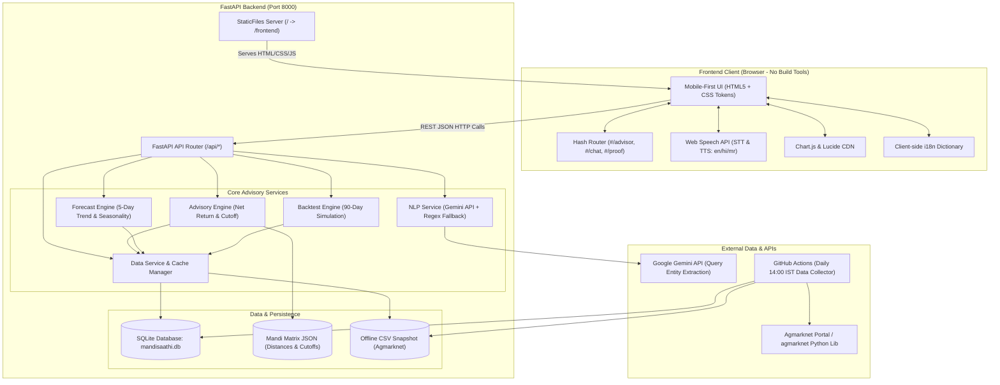
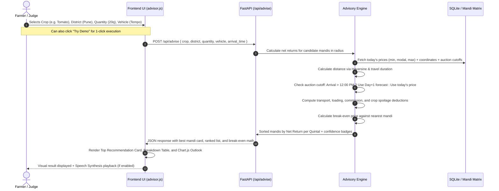
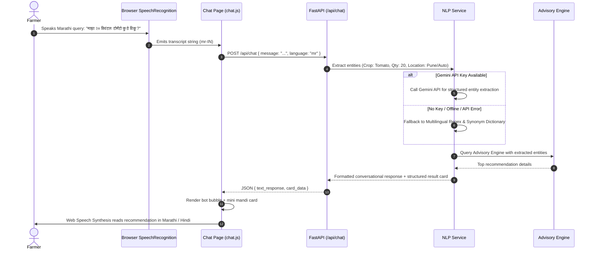
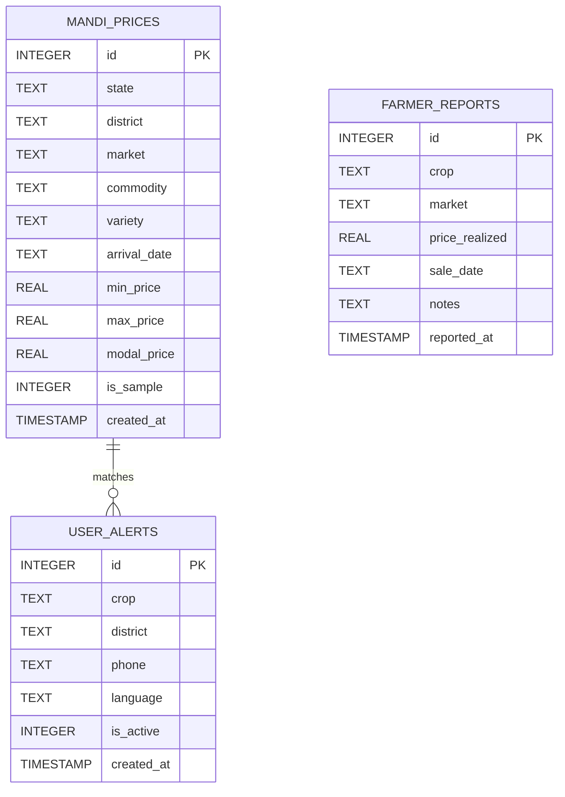

# Mandi Saathi — Architecture & Technical Design Document

**System Name:** Mandi Saathi (AI Mandi Price & Sell-Timing Advisor)  
**Architecture Style:** Modular Monolith (FastAPI + Embedded SQLite + Vanilla ES6 SPA)  
**Runtime Environment:** Python 3.10+ / ASGI (Uvicorn) / Modern Web Browser (HTML5/ES6)  
**Document Status:** Complete & Approved (Version 1.0)  

---

## 1. High-Level System Architecture

Mandi Saathi is built on a resilient, single-process **Modular Monolith** architecture designed for rapid zero-dependency deployment, sub-millisecond in-memory processing, and rock-solid fallback reliability during hackathon evaluations.



---

## 2. End-to-End Application Flow

### 2.1 User Advisory Flow (Advisor Page)


### 2.2 Voice & Chat Interaction Flow


---

## 3. Mathematical Models & Business Logic

### 3.1 Net Return Calculation Formulation
The core differentiator of Mandi Saathi is calculating actual take-home earnings per quintal:

$$\text{Net Return (₹/q)} = P_{\text{expected}} - C_{\text{transport}} - C_{\text{handling}} - C_{\text{commission}} - C_{\text{spoilage}}$$

#### Component Breakdown:
1. **Expected Selling Price ($P_{\text{expected}}$):**
   - For nearby mandis (same-day arrival): Modal price of today $P_{\text{modal}}$.
   - For distant mandis requiring next-day auction: Uses the conservative lower bound of the 1-day forecast corridor ($P_{\text{forecast, low}}$).
2. **Transport Cost per Quintal ($C_{\text{transport}}$):**
   $$C_{\text{transport}} = \frac{2 \times \text{Distance (km)} \times R_{\text{vehicle}}}{Q}$$
   *Where:*
   - $\text{Distance (km)}$ = Haversine road-adjusted distance between farmer's village/district center and the mandi.
   - $R_{\text{vehicle}}$ = Vehicle running rate per km (e.g., Own Bike/Cart = ₹6/km; Tempo = ₹18/km; Mini Truck = ₹28/km).
   - $Q$ = Total batch quantity in quintals (subject to vehicle capacity).
3. **Handling & Labor Cost ($C_{\text{handling}}$):**
   Fixed labor cost for loading at farm and unloading at APMC yard:
   $$C_{\text{handling}} = \text{Rate}_{\text{loading}} + \text{Rate}_{\text{unloading}} \quad (\text{Default: ₹15 + ₹15 = ₹30/q})$$
4. **Market Cess & APMC Commission ($C_{\text{commission}}$):**
   $$C_{\text{commission}} = P_{\text{expected}} \times \text{Commission Rate} \quad (\text{Default: 1.5\% to 2.0\%})$$
5. **Transit Spoilage Deduction ($C_{\text{spoilage}}$):**
   Perishability tax reflecting transit time and delay:
   $$C_{\text{spoilage}} = P_{\text{expected}} \times \left( \frac{\text{Travel Hours} + \text{Delay Hours}}{24} \right) \times S_{\text{crop}}$$
   *Crop-specific daily spoilage rates ($S_{\text{crop}}$):*
   - Tomato: 2.5% per day (high perishability)
   - Potato: 0.5% per day
   - Onion: 0.3% per day
   - Soybean / Tur / Wheat / Cotton: 0.05% per day (dry non-perishable)

---

### 3.2 Arrival Cutoff & Next-Day Auction Logic
Each mandi has an operational auction cutoff time (default: 12:00 PM IST):
$$\text{Arrival Time} = T_{\text{departure}} + \left( \frac{\text{Distance (km)}}{V_{\text{vehicle}}} \right) + T_{\text{unloading buffer}}$$
- **Rule:** If $\text{Arrival Time} > \text{Mandi Cutoff Time}$:
  - Farmer misses the morning auction.
  - Selling day becomes $\text{Date} + 1$.
  - Price is evaluated against Day+1 forecasted range.
  - An overnight holding charge (₹10/quintal) is automatically added to costs.

---

### 3.3 Break-Even Price Calculation
To help the farmer evaluate risk, the break-even price indicates the exact rate a distant mandi must achieve to beat selling at the nearest local mandi:

$$P_{\text{breakeven}} = \text{Net Return}_{\text{nearest}} + C_{\text{transport, distant}} + C_{\text{handling}} + C_{\text{commission}} + C_{\text{spoilage, distant}}$$

If the current market modal price at the distant mandi is less than $P_{\text{breakeven}}$, travelling there is an active financial loss.

---

### 3.4 Data Confidence & Freshness Scoring
Data trust is quantified through a transparent confidence score:

$$\text{Confidence Score} = w_{\text{recency}} \cdot S_{\text{recency}} + w_{\text{density}} \cdot S_{\text{density}}$$

- **Recency Points ($S_{\text{recency}}$):**
  - Updated today: 1.0 (High)
  - Updated 1 day ago: 0.8 (High)
  - Updated 2 days ago: 0.5 (Medium)
  - Updated 3 days ago: 0.3 (Medium)
  - Updated >3 days ago: 0.0 (Stale — Excluded from top advice)
- **Reporting Density ($S_{\text{density}}$):**
  - $\ge 20$ trading records in last 30 days: 1.0
  - $10 - 19$ records: 0.7
  - $< 10$ records: 0.4

---

## 4. Frontend Architecture (Vanilla ES6 SPA)

The frontend is intentionally crafted with **Zero NPM Build Steps** (no React, no Webpack, no Vite) to ensure instantaneous page loads, zero runtime bundle crashes, and total transparency.

```
frontend/
├── index.html                 # Single HTML shell with meta tags, CDNs, header & bottom nav
├── css/
│   ├── theme.css              # CSS Variables (Color tokens, font sizes, shadows, radii)
│   ├── components.css         # Reusable atomic classes (.card, .btn, .badge, .chip, .input)
│   └── styles.css             # Layout grids, header, mobile bottom nav, animations
├── js/
│   ├── app.js                 # Global bootstrapping, language toggle handler, Lucide icon trigger
│   ├── router.js              # Client-side hash router supporting browser back/forward buttons
│   ├── i18n.js                # Trilingual dictionary (English, Hindi, Marathi) with persistent storage
│   ├── api.js                 # Unified fetch wrapper with error handling & loading state
│   ├── voice.js               # Browser Web Speech API manager (STT input & TTS playback)
│   └── pages/
│       ├── advisor.js         # Core advisory form, try-demo autofill, ranked results cards
│       ├── chat.js            # WhatsApp-style chat interface with mic and audio playback
│       ├── alerts.js          # Daily subscription preference & 07:00 AM briefing preview
│       ├── proof.js           # 90-day backtest simulation dashboard & win-loss breakdown
│       ├── about.js           # Hackathon problem statement, methodology, and Agmarknet credits
│       └── design.js          # Complete living UI design system preview & component showcase
```

### 4.1 Design Token Palette (`theme.css`)
| CSS Variable | Hex Code | Semantic Role |
| :--- | :--- | :--- |
| `--bg` | `#F4FAF5` | Calming pastel agricultural background |
| `--card` | `#FFFFFF` | Crisp elevated surface for content cards |
| `--primary` | `#81C784` | Soft natural green accent & bot chat bubbles |
| `--primary-dark`| `#4CAF50` | Primary action buttons and selected chip borders |
| `--text` | `#1F3A2B` | High-contrast deep forest green typography |
| `--muted` | `#6B8576` | Secondary body text and metadata labels |
| `--peach` | `#FFE9D2` | Warning highlights and break-even notice banners |
| `--sky` | `#E3F1FB` | Informational cards and price range track |
| `--yellow` | `#FFF6D6` | Cautionary freshness badges (2–3 days stale) |
| `--red-soft` | `#F9D3CF` | Alert badges for outdated or volatile markets |
| `--border` | `#E1EFE4` | Subtle card dividers and form borders |

---

## 5. Backend Architecture (FastAPI & Service Layer)

The backend exposes clean REST endpoints while encapsulating domain logic in dedicated, testable service modules.

```
backend/
├── main.py                    # FastAPI application factory, lifespan startup, CORS & static mount
├── config.py                  # Environment variable loader (HOST, PORT, DB_PATH, GEMINI_KEY)
├── database.py                # SQLite connection pool, schema migrations, and helper queries
├── config.yaml                # Default economic parameters (transport rates, spoilage, cutoffs)
├── routes/
│   ├── __init__.py
│   ├── advisor.py             # Handles POST /api/advise (Core ranking engine)
│   ├── crops.py               # Handles GET /api/crops, GET /api/mandis, GET /api/prices
│   ├── forecast.py            # Handles GET /api/forecast & GET /api/storage-advice
│   ├── backtest.py            # Handles GET /api/backtest (90-day performance verification)
│   ├── chat.py                # Handles POST /api/chat (Multilingual voice/text parsing)
│   └── alerts.py              # Handles GET/POST /api/alerts & farmer crowd reports
├── services/
│   ├── __init__.py
│   ├── advisory_engine.py     # Net return math, vehicle pricing, cutoff logic, break-even
│   ├── forecast_engine.py     # 5-day price corridor calculations & sell-or-store heuristic
│   ├── backtest_engine.py     # Historical 90-day simulation vs nearest mandi baseline
│   ├── nlp_service.py         # Gemini API entity extraction + Multilingual regex fallback
│   ├── agmarknet_fetcher.py   # Ingestion from agmarknet Python library & CSV reader
│   └── data_service.py        # Central data provider with automatic snapshot fallback
└── tests/
    ├── test_advisory.py       # Unit tests for net return & auction cutoff edge cases
    ├── test_forecast.py       # Unit tests for time series bounds
    └── test_data_service.py   # Tests for CSV snapshot fallback & data freshness
```

---

## 6. Database Schema & Data Models

### 6.1 Database Entity Relationship Diagram


### 6.2 SQLite Table Definitions
```sql
-- Historical and daily mandi market prices
CREATE TABLE IF NOT EXISTS mandi_prices (
    id INTEGER PRIMARY KEY AUTOINCREMENT,
    state TEXT NOT NULL,
    district TEXT NOT NULL,
    market TEXT NOT NULL,
    commodity TEXT NOT NULL,
    variety TEXT,
    arrival_date TEXT NOT NULL,
    min_price REAL NOT NULL,
    max_price REAL NOT NULL,
    modal_price REAL NOT NULL,
    is_sample INTEGER DEFAULT 0,
    created_at TIMESTAMP DEFAULT CURRENT_TIMESTAMP
);

CREATE INDEX IF NOT EXISTS idx_mandi_query 
ON mandi_prices(commodity, district, arrival_date);

CREATE INDEX IF NOT EXISTS idx_market_commodity 
ON mandi_prices(market, commodity, arrival_date);

-- Daily briefing subscriptions
CREATE TABLE IF NOT EXISTS user_alerts (
    id INTEGER PRIMARY KEY AUTOINCREMENT,
    crop TEXT NOT NULL,
    district TEXT NOT NULL,
    phone TEXT,
    language TEXT DEFAULT 'mr',
    is_active INTEGER DEFAULT 1,
    created_at TIMESTAMP DEFAULT CURRENT_TIMESTAMP
);

-- Farmer crowdsourced price verification ("I Sold Today")
CREATE TABLE IF NOT EXISTS farmer_reports (
    id INTEGER PRIMARY KEY AUTOINCREMENT,
    crop TEXT NOT NULL,
    market TEXT NOT NULL,
    price_realized REAL NOT NULL,
    sale_date TEXT NOT NULL,
    notes TEXT,
    is_verified INTEGER DEFAULT 0,
    reported_at TIMESTAMP DEFAULT CURRENT_TIMESTAMP
);
```

---

## 7. API Specification & REST Contracts

### 7.1 Health & Data Status
- **`GET /api/health`**
  - *Response:* `{"status": "ok", "service": "Mandi Saathi", "version": "1.0.0", "hackathon": "VORTEX 2K26"}`
- **`GET /api/data-status`**
  - *Response:* `{"source": "snapshot", "latest_date": "2026-10-05", "total_records": 12480, "monitored_mandis": 42, "is_sample": false}`

### 7.2 Advisory Recommendation
- **`POST /api/advise`**
  - *Request Body:*
    ```json
    {
      "crop": "Tomato",
      "district": "Pune",
      "quantity_quintals": 20.0,
      "vehicle_type": "tempo",
      "departure_hour": 7,
      "language": "mr"
    }
    ```
  - *Response Body:*
    ```json
    {
      "best_recommendation": {
        "market": "Pune (Gultekdi)",
        "district": "Pune",
        "net_return_per_quintal": 1820.0,
        "total_net_earnings": 36400.0,
        "gross_modal_price": 2000.0,
        "price_range": {"min": 1700.0, "modal": 2000.0, "max": 2300.0},
        "distance_km": 15.0,
        "travel_hours": 0.5,
        "cost_deductions": {
          "transport": 54.0,
          "handling": 30.0,
          "commission": 40.0,
          "spoilage": 56.0
        },
        "confidence": "HIGH",
        "last_reported_days_ago": 0,
        "one_line_verdict": "Highest net profit after low travel and near-zero spoilage."
      },
      "comparisons": [
        {
          "market": "Narayangaon",
          "district": "Pune",
          "net_return_per_quintal": 1740.0,
          "gross_modal_price": 2100.0,
          "distance_km": 72.0,
          "break_even_price": 2180.0,
          "confidence": "HIGH"
        }
      ]
    }
    ```

### 7.3 Outlook & Sell-or-Store
- **`GET /api/forecast?crop=Soybean&market=Latur`**
  - *Response:*
    ```json
    {
      "crop": "Soybean",
      "market": "Latur",
      "trend": "BULLISH",
      "confidence": "MEDIUM",
      "forecast_5_days": [
        {"day": "Day 1", "date": "2026-10-07", "low": 4500, "likely": 4620, "high": 4750},
        {"day": "Day 2", "date": "2026-10-08", "low": 4540, "likely": 4680, "high": 4820},
        {"day": "Day 3", "date": "2026-10-09", "low": 4600, "likely": 4750, "high": 4900},
        {"day": "Day 4", "date": "2026-10-10", "low": 4620, "likely": 4790, "high": 4950},
        {"day": "Day 5", "date": "2026-10-11", "low": 4650, "likely": 4830, "high": 5000}
      ]
    }
    ```
- **`GET /api/storage-advice?crop=Soybean`**
  - *Response:*
    ```json
    {
      "crop": "Soybean",
      "advice": "STORE",
      "recommended_hold_days": 5,
      "expected_gross_gain_per_quintal": 210.0,
      "estimated_storage_cost_per_quintal": 35.0,
      "estimated_net_gain_per_quintal": 175.0,
      "verdict_reason": "Expected price recovery exceeds 5-day warehouse holding charges."
    }
    ```

---

## 8. Directory & File Structure (Current vs. Target)

### 8.1 Target Production Directory Tree
```
mandiSaaathi/
├── .env.example                       # Template for HOST, PORT, GEMINI_API_KEY
├── .gitignore                         # Excludes .env, __pycache__, and mandisaathi.db
├── README.md                          # Project documentation, quickstart & video link
├── requirements.txt                   # FastAPI, Uvicorn, Pandas, Agmarknet, Pydantic
├── PRD.md                             # Comprehensive Product Requirements Document
├── ARCHITECTURE.md                    # System Architecture & Technical Specifications
├── ROADMAP.md                         # Phase breakdown, status & implementation flow
├── .github/
│   └── workflows/
│       └── daily.yml                  # Automated cron job for daily Agmarknet data ingestion
├── data/
│   ├── agmarknet_maharashtra_snapshot.csv  # 90-day historical snapshot for offline fallback
│   ├── mandi_matrix.json              # Coordinates, distances, and APMC auction cutoff times
│   └── mandisaathi.db                 # Auto-generated SQLite database
├── scripts/
│   ├── backfill.py                    # Backfills 90 days of Agmarknet data into SQLite
│   └── daily_update.py                # Fetches last 3 days and updates snapshot CSV
├── backend/
│   ├── __init__.py
│   ├── main.py                        # FastAPI entrypoint, lifespan, and static mounting
│   ├── config.py                      # Path resolving and environment configuration
│   ├── database.py                    # SQLite connection factory and schema initialization
│   ├── config.yaml                    # Vehicle fuel rates, labor costs, and spoilage constants
│   ├── routes/
│   │   ├── __init__.py
│   │   ├── advisor.py                 # POST /api/advise
│   │   ├── crops.py                   # GET /api/crops, /api/mandis, /api/prices
│   │   ├── forecast.py                # GET /api/forecast, /api/storage-advice
│   │   ├── backtest.py                # GET /api/backtest
│   │   ├── chat.py                    # POST /api/chat
│   │   └── alerts.py                  # Alerts and farmer crowd submissions
│   ├── services/
│   │   ├── __init__.py
│   │   ├── agmarknet_fetcher.py       # Client for agmarknet Python library
│   │   ├── data_service.py            # Unified cache & fallback provider
│   │   ├── advisory_engine.py         # Net return, distance, and cutoff calculations
│   │   ├── forecast_engine.py         # Moving averages, trend, and confidence corridors
│   │   ├── backtest_engine.py         # 90-day simulation engine
│   │   └── nlp_service.py             # Gemini API connector with regex fallback
│   └── tests/
│       ├── test_advisory.py           # Verification of math and ranking logic
│       ├── test_forecast.py           # Verification of time-series outlook
│       └── test_data_service.py       # Verification of snapshot fallback
└── frontend/
    ├── index.html                     # HTML5 SPA shell, viewport config, CDN imports
    ├── assets/
    │   └── icons/                     # SVG icons and favicon assets
    ├── css/
    │   ├── theme.css                  # Pastel color palette & typography tokens
    │   ├── components.css             # Reusable UI component styles
    │   └── styles.css                 # Layout structure and responsive rules
    └── js/
        ├── app.js                     # Root bootstrap and Lucide icon initializer
        ├── router.js                  # Hash change router (#/advisor, #/chat, etc.)
        ├── i18n.js                    # Trilingual text dictionary (EN, HI, MR)
        ├── api.js                     # Centralized API fetcher
        ├── voice.js                   # Web Speech API speech-to-text & text-to-speech
        └── pages/
            ├── advisor.js             # Main advisor calculator and result cards
            ├── chat.js                # Conversational WhatsApp-style voice chat
            ├── alerts.js              # Morning briefing alert configuration
            ├── proof.js               # 90-day backtest proof and validation charts
            ├── about.js               # Mission, team, methodology, and citations
            └── design.js              # Interactive UI design system test bench
```
