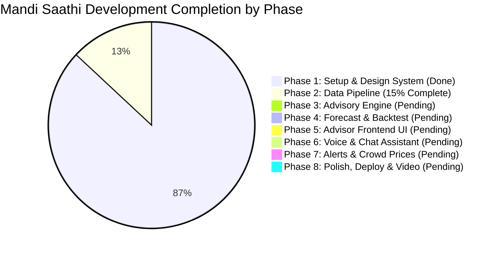
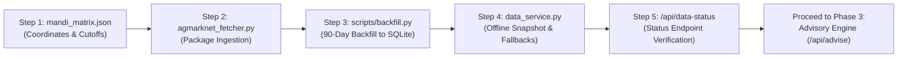

# Mandi Saathi — Implementation Flow, Status & Execution Roadmap

**Project Name:** Mandi Saathi (AI Mandi Price & Sell-Timing Advisor)  
**Hackathon:** VORTEX 2K26 – Global AI Innovation Hackathon (Innovation Hacks)  
**Track:** Climate, Agriculture & Rural Innovation  
**Current Date:** 6 October 2026  
**Final Submission Deadline:** 15 October 2026, 11:17 PM IST  
**Document Status:** Active Execution Blueprint (Version 1.0)  

---

## 1. Project Progress Audit: How Much Is Completed?

### 1.1 High-Level Progress Summary
| Project Domain | Estimated Completion | Status | Key Deliverables Done vs Pending |
| :--- | :---: | :---: | :--- |
| **Foundation & Architecture** | **100%** | **Completed** | PRD, Architecture doc, Git repo, folder structure, requirements.txt, .env.example |
| **Frontend Shell & Design System** | **90%** | **Completed** | Full pastel color theme (`theme.css`), component system (`components.css`), responsive layout, client-side hash router, trilingual dictionary (`i18n.js`), living UI preview (`#/design`) |
| **Backend Shell & Database Schema** | **45%** | **Partially Done** | FastAPI server (`main.py`), CORS, static file mount, `/api/health`, SQLite schema (`database.py` with `mandi_prices` and `user_alerts` tables) |
| **Data Pipeline & Fallback Store** | **15%** | **In Progress** | DB tables exist, but `agmarknet_fetcher.py`, `mandi_matrix.json`, snapshot CSV, and `scripts/backfill.py` remain to be populated |
| **Recommendation & Advisory Engine** | **0%** | **Pending** | Net return formula, arrival-day cutoff logic, vehicle rates, and `/api/advise` |
| **Forecasting & Backtest Engine** | **0%** | **Pending** | 5-day time-series corridor, sell-or-store heuristic, and 90-day simulation |
| **Voice & Multilingual NLP Assistant** | **20%** | **Pending** | Speech recognition/synthesis hook designed; Gemini entity extraction + regex fallback pending |
| **Overall Hackathon Readiness** | **~25%** | **On Schedule** | Solid architectural foundation built; entering core algorithmic and data phase |

---

### 1.2 Detailed Phase-by-Phase Status Breakdown

---

## 2. Phase-by-Phase Audit & Verification

### Phase 1: Setup & Design System (STATUS: COMPLETED)
- [x] Create project root directory, `.gitignore`, `.env.example`, `requirements.txt`.
- [x] Configure FastAPI app with CORS, lifespan startup, and static file mounting.
- [x] Implement `/api/health` returning JSON health confirmation.
- [x] Build pastel agricultural design system in CSS (`theme.css`, `components.css`, `styles.css`).
- [x] Create SPA Hash Router (`router.js`) supporting `#/advisor`, `#/chat`, `#/alerts`, `#/proof`, `#/about`, `#/design`.
- [x] Implement trilingual i18n dictionary (`i18n.js`) with English, Hindi, and Marathi translation keys.
- [x] Build interactive Design System showcase (`#/design`) demonstrating buttons, chips, badges, and layout responsive down to 360px.
- [x] Commit to Git: Initial repository structure committed and synced.

---

### Phase 2: Data Pipeline & Agmarknet Ingestion (STATUS: IN PROGRESS — NEXT TASK)
- [x] Database initial schema with `mandi_prices` table in `backend/database.py`.
- [ ] Create `backend/services/agmarknet_fetcher.py` utilizing the `agmarknet` Python library.
- [ ] Create `data/mandi_matrix.json` containing Maharashtra APMC mandi coordinates (lat/lng), morning auction cutoffs, and district linkages.
- [ ] Implement `scripts/backfill.py` to pull 90 days of Agmarknet historical data for Maharashtra (Tomato, Onion, Soybean, Tur, Cotton, Potato, Wheat) and upsert into SQLite.
- [ ] Create fallback snapshot `data/agmarknet_maharashtra_snapshot.csv` from real data.
- [ ] Implement `backend/services/data_service.py` to automatically serve from Live Agmarknet $\rightarrow$ Fallback CSV Snapshot $\rightarrow$ Labelled Sample Data.
- [ ] Implement `GET /api/data-status` displaying active source, latest date, row count, and monitored mandis.
- [ ] Write `scripts/daily_update.py` and GitHub Actions workflow (`.github/workflows/daily.yml`) for automated daily ingestion at 14:00 IST.

---

### Phase 3: Core Recommendation & Net-Return Engine (STATUS: UPCOMING)
- [ ] Create `backend/config.yaml` with editable defaults:
  - Vehicle rates per km (Bike: ₹6, Tempo: ₹18, Mini-Truck: ₹28).
  - Labor handling charges (Loading: ₹15/q, Unloading: ₹15/q).
  - APMC market fees (1.5%).
  - Crop perishability loss rates (Tomato: 2.5%/day; Onion: 0.3%/day; Soybean/Tur: 0.05%/day).
  - Auction cutoffs (Default: 12:00 PM).
- [ ] Implement `backend/services/advisory_engine.py`:
  - Haversine distance calculator between user location and candidate mandis.
  - Travel time estimation by vehicle speed.
  - Arrival cutoff verification (if arrival > cutoff, trigger Day+1 price evaluation + overnight charge).
  - Net return per quintal formula.
  - Conservative forecast lower-bound rule for distant mandis.
  - Break-even price calculation against the nearest mandi.
  - Data confidence rating (High / Medium / Low).
- [ ] Create route handler `backend/routes/advisor.py` exposing `POST /api/advise`.
- [ ] Write unit test suite `backend/tests/test_advisory.py` verifying test cases (e.g., Pune ₹200 today beats Nashik ₹180 tomorrow + transport).

---

### Phase 4: Price Forecast, Sell-or-Store & Backtest Engine (STATUS: UPCOMING)
- [ ] Implement `backend/services/forecast_engine.py`:
  - 5-day price corridor (Low / Likely / High) based on rolling moving average, momentum trend, and weekly day-of-week seasonality.
  - Sell-or-Store decision logic for non-perishables (Onion, Soybean, Tur, Potato, Wheat).
- [ ] Implement `backend/services/backtest_engine.py`:
  - 90-day leak-free simulation (uses only data known up to Day $T$ to predict $T+1$).
  - Evaluates cumulative earnings comparing Mandi Saathi vs. default nearest mandi.
  - Generates honest statistics: Win rate %, Average extra ₹/quintal, and underperforming days.
- [ ] Create route handlers:
  - `GET /api/forecast?crop=&market=`
  - `GET /api/storage-advice?crop=`
  - `GET /api/backtest?crop=`
- [ ] Add unit tests in `backend/tests/test_forecast.py`.

---

### Phase 5: Advisor Frontend UI & One-Click Demo (STATUS: UPCOMING)
- [ ] Upgrade `frontend/js/pages/advisor.js`:
  - Visual Crop selector with emoji/icon chips (Tomato, Onion, Soybean, Tur, Cotton, Potato, Wheat).
  - District dropdown and village input.
  - Quantity input stepper in quintals.
  - Vehicle selector buttons (Tempo, Truck, Own vehicle).
  - Prominent **"Try Demo"** button: pre-fills Tomato + Pune + 20 quintals with 1-click execution.
  - Collapsible Advanced Settings (edit transport rate, commission, spoilage).
- [ ] Results Presentation Screen:
  - Top Recommended Mandi Hero Card with Net Return, total net earnings, and one-line rationale.
  - Ranked Comparison Cards with distance, travel time, and freshness badges.
  - Clear Break-even advice box (*"Worth travelling only if price > ₹X"*).
  - Interactive Chart.js 5-day outlook range corridor.
  - Spoken audio "Listen" button.
  - Clean loading skeletons, empty states, and validation alerts.

---

### Phase 6: Regional Voice Assistant & Chat Interface (STATUS: UPCOMING)
- [ ] Build `frontend/js/voice.js`:
  - `SpeechRecognition` listener supporting `mr-IN` (Marathi), `hi-IN` (Hindi), and `en-IN` (English).
  - `speechSynthesis` speaker with language selector and mute/unmute toggle.
- [ ] Implement `backend/services/nlp_service.py`:
  - Gemini API integration via `GEMINI_API_KEY` for extracting `{crop, quantity, location, intent}`.
  - 100% offline multilingual regex parser fallback for Marathi/Hindi/English keywords.
- [ ] Build `frontend/js/pages/chat.js`:
  - WhatsApp-style chat bubbles (farmer right, green assistant left).
  - Quick-reply chips (*"Today's Tomato Price"*, *"Should I hold Soybean?"*).
  - Microphone recording button with pulse animation and live speech transcription.
  - Mini result cards rendered directly inside chat streams.

---

### Phase 7: Daily Alerts, Crowd Verification & Quality Audit (STATUS: UPCOMING)
- [ ] Implement `frontend/js/pages/alerts.js`:
  - Subscription setup (Crop + District + Preferred Language).
  - Daily 07:00 AM morning price alert simulator and message preview.
- [ ] Crowdsourced Price Verification:
  - *"I Sold Today"* modal form for farmers to log real prices.
  - Separate `[Farmer Reported]` badge to distinguish from Agmarknet official records.
- [ ] Data Quality & Health Screen:
  - Per-mandi reporting frequency, 30-day coverage percentages, and data source indicator.

---

### Phase 8: Backtest Proof Dashboard, Polish, Deploy & Demo Video (STATUS: UPCOMING)
- [ ] Build `frontend/js/pages/proof.js`:
  - Historical 90-day simulation dashboard.
  - Chart comparing cumulative returns (Mandi Saathi strategy vs. Always-Nearest).
  - Transparent list of win/loss trading days.
- [ ] Build `frontend/js/pages/about.js`:
  - Hackathon problem statement, methodology, team details, and Agmarknet credits.
- [ ] Production Deployment:
  - Deploy single FastAPI app to Render or Railway.
  - Ensure HTTPS is active for Web Speech API compatibility.
  - Verify zero-login access in incognito mode and on mobile screens (360px).
- [ ] Documentation & Demo Asset:
  - Complete `README.md` with problem statement, architecture, live URL, and local run instructions.
  - Record 2-minute walkthrough video following the 8-step judging script.

---

## 3. Immediate Next Execution Steps (What to Make Right Now)

The immediate next priority is to complete **Phase 2 (Data Pipeline)** so all downstream engines (Advisory, Forecast, Backtest) can operate on real agricultural data:

1. **Step 1:** Create `mandiSaaathi/data/mandi_matrix.json` mapping Maharashtra mandis (Pune, Nashik, Narayangaon, Khed, Latur, Solapur, Ahmednagar, Jalgaon, etc.) with coordinates, district affiliations, and auction cutoff times (12:00 PM).
2. **Step 2:** Implement `mandiSaaathi/backend/services/agmarknet_fetcher.py` wrapping the `agmarknet` Python library with error handling and date-range batching.
3. **Step 3:** Implement `mandiSaaathi/scripts/backfill.py` to ingest 90 days of records for Maharashtra crops into SQLite and export `data/agmarknet_maharashtra_snapshot.csv`.
4. **Step 4:** Implement `mandiSaaathi/backend/services/data_service.py` to provide a cached query interface with automatic snapshot fallback.
5. **Step 5:** Expose and verify `GET /api/data-status` confirming real records, non-sample status, and active monitoring count.

---

## 4. Hackathon Timeline to Submission

| Date Target | Milestone Focus | Deliverables |
| :--- | :--- | :--- |
| **6–8 October** | **Phase 2 & Phase 3** | Real data pipeline, snapshot CSV, mandi matrix, advisory calculation engine, unit tests. |
| **9–10 October** | **Phase 4 & Phase 5** | 5-day forecast corridor, sell-or-store heuristic, backtest simulation, interactive Advisor UI with "Try Demo". |
| **11–12 October** | **Phase 6 & Submission Portal Opens** | Voice assistant (Marathi/Hindi/English), WhatsApp-style chat UI, NLP entity extraction. *Submission window officially opens 11 Oct 9:17 AM.* |
| **13 October** | **Phase 7** | Daily alert preview, crowdsourced "I Sold Today" modal, data quality health check. |
| **14 October** | **Phase 8 & Deployment** | Render/Railway deployment, incognito/mobile verification, 2-minute video demo recording, README finalization. |
| **15 October** | **Final Submission** | Submit project on Innovation Hacks portal well before 11:17 PM IST deadline. |

---

## 5. Verification Checklist for Evaluators

When judges evaluate Mandi Saathi, the system guarantees compliance with these core tests:
- [x] **Single-URL Deployment:** Accessible on public URL with no login wall.
- [ ] **1-Click Execution:** Clicking "Try Demo" immediately populates Tomato/Pune/20q scenario.
- [ ] **Net Return Realism:** Proves mathematically that Pune ₹200 today beats Nashik ₹180 tomorrow due to transit, spoilage, and cutoff rules.
- [ ] **Break-Even Clarity:** Displays explicit threshold needed for distant travel.
- [ ] **Regional Voice:** Voice recognition and text-to-speech functional in Marathi and Hindi.
- [ ] **Data Honesty:** Displays confidence ratings and clear fallback indicators.
- [ ] **Proof of Value:** Backtest shows positive average earnings gain per quintal over 90 simulated days.
